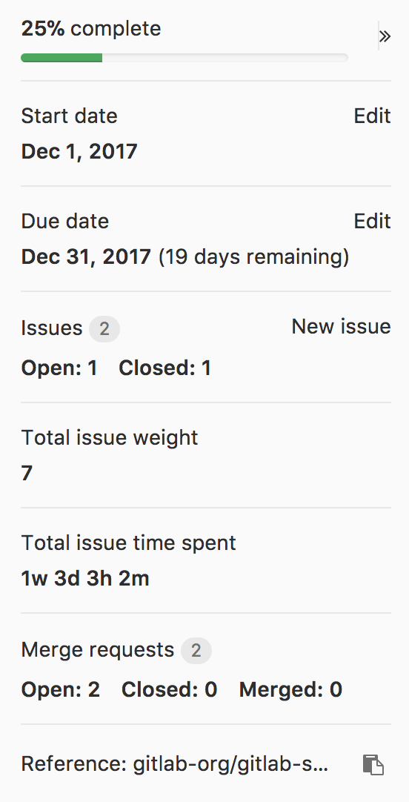

# Milestones

Milestones allow you to organize issues and merge requests into a cohesive group,
optionally setting a due date. A common use is keeping track of an upcoming
software version. Milestones can be created per-project or per-group.

## Creating a project milestone

>**Note:**
You need [Master permissions](../../permissions.md) in order to create a milestone.

You can find the milestones page under your project's **Issues ➔ Milestones**.
To create a new milestone, simply click the **New milestone** button when in the
milestones page. A milestone can have a title, a description and start/due dates.
Once you fill in all the details, hit the **Create milestone** button.

## Creating a group milestone

>**Note:**
You need [Master permissions](../../permissions.md) in order to create a milestone.

You can create a milestone for a group that will be shared across group projects.
On the group's **Issues ➔ Milestones** page, you will be able to see the state
of that milestone and the issues/merge requests count that it shares across the group projects. To create a new milestone click the **New milestone** button. The form is the same as when creating a milestone for a specific project which you can find in the previous item.

In addition to that you will be able to filter issues or merge requests by group milestones in all projects that belongs to the milestone group.

## Milestone promotion

Project milestones can be promoted to group milestones if its project belongs to a group. When a milestone is promoted all other milestones across the group projects with the same title will be merged into it, which means all milestone's children like issues, merge requests and boards will be moved into the new promoted milestone.
The promote button can be found in the milestone view or milestones list.

## Special milestone filters

In addition to the milestones that exist in the project or group, there are some
special options available when filtering by milestone:

* **No Milestone** - only show issues or merge requests without a milestone.
* **Upcoming** - show issues or merge request that belong to the next open
  milestone with a due date, by project. (For example: if project A has
  milestone v1 due in three days, and project B has milestone v2 due in a week,
  then this will show issues or merge requests from milestone v1 in project A
  and milestone v2 in project B.)
* **Started** - show issues or merge requests from any milestone with a start
  date less than today. Note that this can return results from several
  milestones in the same project.

## Milestone sidebar

The milestone sidebar shows percentage complete, start date and due date,
issues, total issue weight, total issue time spent, and merge requests.

The percentage complete is calcualted as: Closed and merged merge requests plus all closed issues divided by
total merge requests and issues.

## Quick actions

[Quick actions](../quick_actions.md) are available for assigning and removing
project and group milestones.
